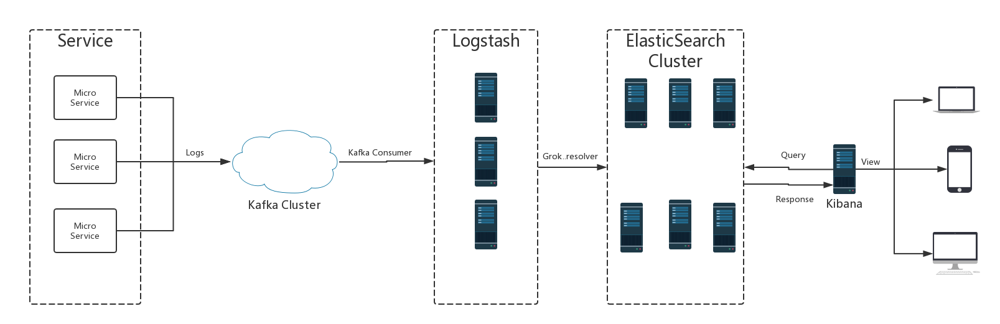

## ELK Deploy Doc
### 1. Version
6.x
### 2. Architecture

### 3. Logback Apender For Kafka
- Dependency
```xml
<!--logback appender for kafka  -->
       <dependency>
           <groupId>com.github.danielwegener</groupId>
           <artifactId>logback-kafka-appender</artifactId>
           <version>0.2.0-RC1</version>
           <scope>runtime</scope>
       </dependency>
       <dependency>
           <groupId>ch.qos.logback</groupId>
           <artifactId>logback-classic</artifactId>
           <version>1.2.3</version>
           <scope>runtime</scope>
       </dependency>
       <dependency>
           <groupId>org.springframework.kafka</groupId>
           <artifactId>spring-kafka</artifactId>
       </dependency>
```
- Logback-Spring-Kafka.xml
```xml
<?xml version="1.0" encoding="UTF-8"?>
<!--该日志将日志级别不同的log信息保存到不同的文件中 -->
<configuration scan="true">
    <include resource="org/springframework/boot/logging/logback/defaults.xml" />

    <springProperty scope="context" name="springAppName" source="spring.application.name" />
    <springProperty scope="context" name="port" source="server.port" />

    <!-- 日志在工程中的输出位置 -->
    <!-- <property name="LOG_FILE" value="${BUILD_FOLDER:-build}/${springAppName}" /> -->
    <property name="LOG_PATH" value="./logs/${springAppName}" />

    <!-- 控制台的日志输出样式 -->
    <property name="CONSOLE_LOG_PATTERN" value="%highlight([%d{yyyy-MM-dd HH:mm:ss:sss}] %-5level) %10green([${SERVER-IP}:${port}/${springAppName},%X{X-B3-TraceId:-},%X{X-B3-SpanId:-},%X{X-B3-ParentSpanId:-},%X{X-Span-Export:-},%thread]) %boldMagenta(%logger{36}:%line) - %cyan(%msg%n)" />
    <property name="KAFKA_LOG_PATTERN" value="[%d{yyyy-MM-dd HH:mm:ss:sss}] %-5level %10([${SERVER-IP}:${port}/${springAppName},%X{X-B3-TraceId:-},%X{X-B3-SpanId:-},%X{X-B3-ParentSpanId:-},%X{X-Span-Export:-},%thread]) %logger{36}:%line - %msg%n" />

    <!-- 控制台输出 -->
    <appender name="console" class="ch.qos.logback.core.ConsoleAppender">
        <filter class="ch.qos.logback.classic.filter.ThresholdFilter">
            <level>INFO</level>
        </filter>
        <!-- 日志输出编码 -->
        <encoder>
            <pattern>${CONSOLE_LOG_PATTERN}</pattern>
            <charset>utf8</charset>
        </encoder>
    </appender>

    <!--FileAppender-->
    <appender name="file" class="ch.qos.logback.core.rolling.RollingFileAppender">
        <rollingPolicy class="ch.qos.logback.core.rolling.TimeBasedRollingPolicy">
            <fileNamePattern>${LOG_PATH}/${springAppName}.%d{yyyy-MM-dd}.log</fileNamePattern>
            <maxHistory>60</maxHistory>
        </rollingPolicy>
        <encoder>
            <pattern>${CONSOLE_LOG_PATTERN}</pattern>
            <charset>UTF-8</charset>
        </encoder>
    </appender>

    <appender name="kafkaAppender" class="com.github.danielwegener.logback.kafka.KafkaAppender">
        <encoder>
            <pattern>${KAFKA_LOG_PATTERN}</pattern>
            <charset>utf8</charset>
        </encoder>
        <topic>log4j2</topic>
        <keyingStrategy class="com.github.danielwegener.logback.kafka.keying.NoKeyKeyingStrategy" />
        <deliveryStrategy class="com.github.danielwegener.logback.kafka.delivery.AsynchronousDeliveryStrategy" />

        <!-- Optional parameter to use a fixed partition -->
        <!-- <partition>0</partition> -->

        <!-- Optional parameter to include log timestamps into the kafka message -->
        <!-- <appendTimestamp>true</appendTimestamp> -->

        <!-- each <producerConfig> translates to regular kafka-client config (format: key=value) -->
        <!-- producer configs are documented here: https://kafka.apache.org/documentation.html#newproducerconfigs -->
        <!-- bootstrap.servers is the only mandatory producerConfig -->
        <producerConfig>bootstrap.servers=10.1.105.161:9092</producerConfig>

        <!-- this is the fallback appender if kafka is not available. -->
        <appender-ref ref="file" />
    </appender>
    <appender name="ASYNC" class="ch.qos.logback.classic.AsyncAppender">
        <appender-ref ref="kafkaAppender" />
    </appender>

    <!-- 日志输出级别 -->
    <root level="DEBUG">
        <appender-ref ref="console" />
        <appender-ref ref="ASYNC" />
        <!--<appender-ref ref="file" />-->
    </root>
</configuration>
```
- [Github链接](https://github.com/danielwegener/logback-kafka-appender)  

### 4. Jdk1.8(Skipped)
### 5. Kafka(Skipped)
### 6. Logstash
- System settings

- tar -zxvf ...
- config  

 - logstash-kafka.yml

 ```bash
 input {
     kafka {
             bootstrap_servers => "10.1.105.161:9092"
             topics => ["log4j2"]
             group_id => "elk"
             codec => multiline {
               pattern => "^\["
               negate => true
               what => "previous"

             }
     }
 }

 filter {

   grok {
    match => {"message" => "^\[(?<LoggerDate>.*?)\]\s+%{LOGLEVEL:Level}\s+\[%{IPORHOST:ClientIp}:%{NUMBER:Port}\/(?<ServiceName>.*?),(?<TraceId>.*?),(?<SpanId>.*?),(?<ParentSpanId>.*?),(?<SpanExport>.*?),(?<ThreadName>.*?)\]\s+(?<Reference>.*?):(?<CodeLine>[\d\?]+)\s+\-\s+(?<Msg>.*)"}
    remove_field => ["@version","tags"]
   }

   date {
     match => ["LoggerDate","yyyy-MM-dd HH:mm:ss:SSS"]
     target => "@timestamp"
   }

 }

 output {

   elasticsearch {
       hosts => ["10.1.48.181:9200","10.1.48.182:9200","10.1.48.183:9200"]
       index => "xinhua-log"
       workers => 1
     }
 }
 ```  
- Sysv Startup  

  **Remember:update config/startup.options**  

  bin/system-install sysv  

  > You could install it for upstart,systemd too.  


### 7. Elasticsearch  
- Close iptables
- config
 - elasticsearch.yml  
 ```bash
 # ======================== Elasticsearch Configuration =========================
 #
 # NOTE: Elasticsearch comes with reasonable defaults for most settings.
 #       Before you set out to tweak and tune the configuration, make sure you
 #       understand what are you trying to accomplish and the consequences.
 #
 # The primary way of configuring a node is via this file. This template lists
 # the most important settings you may want to configure for a production cluster.
 #
 # Please consult the documentation for further information on configuration options:
 # https://www.elastic.co/guide/en/elasticsearch/reference/index.html
 #
 # ---------------------------------- Cluster -----------------------------------
 #
 # Use a descriptive name for your cluster:
 #
 cluster.name: xinhua-elk
 #
 # ------------------------------------ Node ------------------------------------
 #
 # Use a descriptive name for the node:
 #
 node.name: node-181
 #
 # Add custom attributes to the node:
 #
 #node.attr.rack: r1
 #
 # ----------------------------------- Paths ------------------------------------
 #
 # Path to directory where to store the data (separate multiple locations by comma):
 #
 path.data: /elk/elasticsearch/data
 #
 # Path to log files:
 #
 path.logs: /elk/elasticsearch/logs
 #
 # ----------------------------------- Memory -----------------------------------
 #
 # Lock the memory on startup:
 #
 #bootstrap.memory_lock: true
 #
 # Make sure that the heap size is set to about half the memory available
 # on the system and that the owner of the process is allowed to use this
 # limit.
 #
 # Elasticsearch performs poorly when the system is swapping the memory.
 #
 # ---------------------------------- Network -----------------------------------
 #
 # Set the bind address to a specific IP (IPv4 or IPv6):
 #
 network.host: 10.1.48.181
 #
 # Set a custom port for HTTP:
 #
 http.port: 9200
 #
 # For more information, consult the network module documentation.
 #
 # --------------------------------- Discovery ----------------------------------
 #
 # Pass an initial list of hosts to perform discovery when new node is started:
 # The default list of hosts is ["127.0.0.1", "[::1]"]
 #
 discovery.zen.ping.unicast.hosts: ["10.1.48.181", "10.1.48.182","10.1.48.183"]
 #
 # Prevent the "split brain" by configuring the majority of nodes (total number of master-eligible nodes / 2 + 1):
 #
 #discovery.zen.minimum_master_nodes:
 #
 # For more information, consult the zen discovery module documentation.
 #
 # ---------------------------------- Gateway -----------------------------------
 #
 # Block initial recovery after a full cluster restart until N nodes are started:
 #
 #gateway.recover_after_nodes: 3
 #
 # For more information, consult the gateway module documentation.
 #
 # ---------------------------------- Various -----------------------------------
 #
 # Require explicit names when deleting indices:
 #
 #action.destructive_requires_name: true
 bootstrap.system_call_filter: false
 ```  

 - bin/elasticsearch -d (Starts Elasticsearch in the background)
